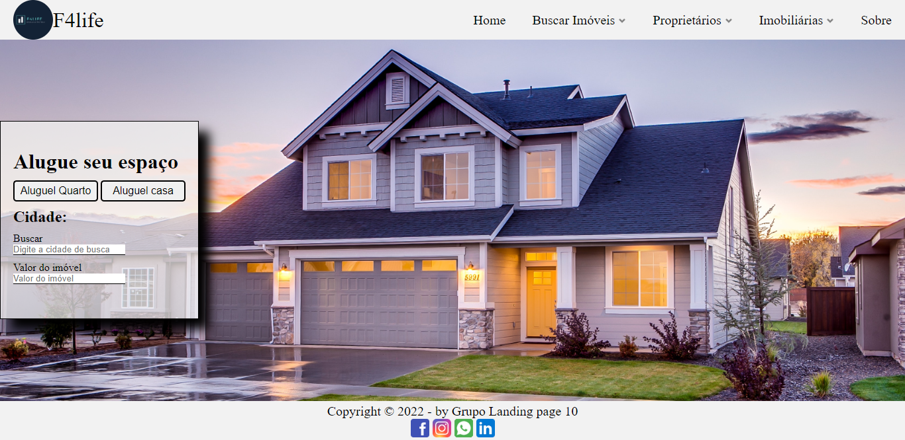
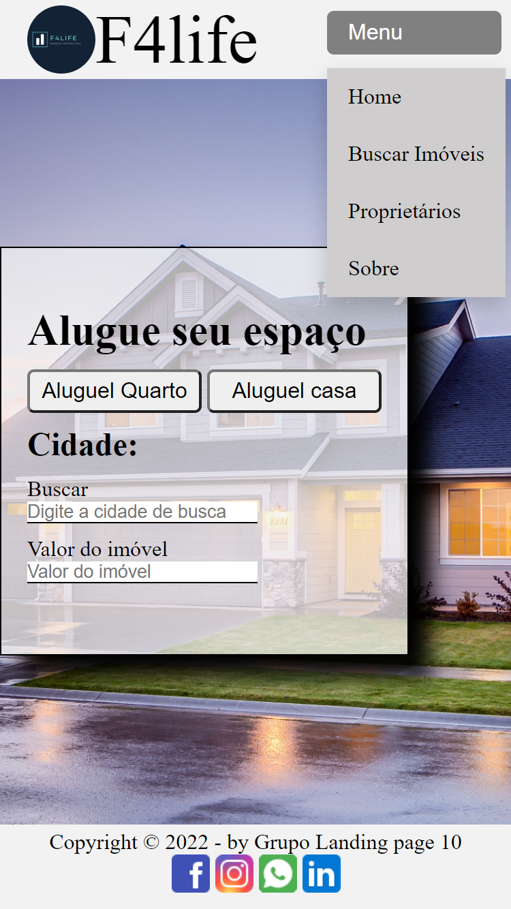
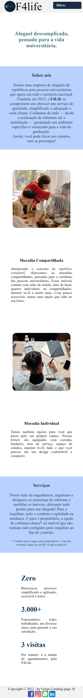

# Projeto Landing Page: F4Life

#### O que funciona

* Menu com _links_ para página inicial(_home_), página de busca de imóveis e página sobre a empresa;
* Responsividade: menus do _header_ diferentes para dispositivos _mobile_ e _desktop_, conteúdos em mais de uma coluna para _desktop_ e uma coluna para dispositivos _mobile_;
* Imagens com _links_ no _footer_ para redes sociais que abrem em outra aba/janela.

#### O que não funciona

* Demais _links_ no menu não levam a outras páginas;
* Formulários de busca não guardam nenhuma informação.
* Página de busca: _cards_ com informação sobre os imóveis e botão para próxima página não são _links_.

#### Link do surge

<https://hurried-rule.surge.sh/>

#### Imagens

